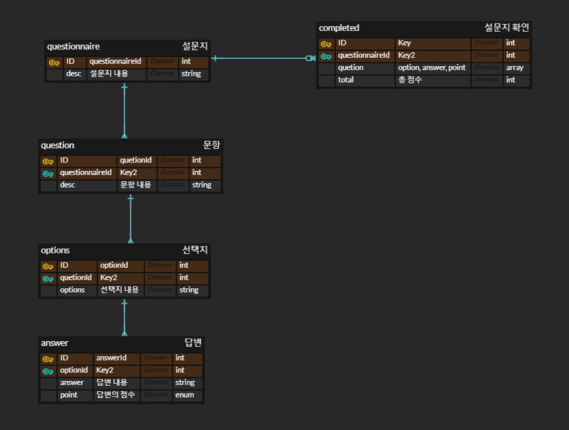

<div align=center>
<h3> :blush:소개 </h3>
설문지 서비스. <br>
설문지 생성, 수정, 삭제, 조회, 설문지 완료, 완료된 설문지 확인 기능이 있습니다

<h3>사용한 기술 스택<h3>


<h3>ERD<h3>


<h4>Link<h4>
https://www.erdcloud.com/d/wn6XsubF9MzD75iaT

<h4>서버 실행 전 확인바랍니다.</h4>
postgres 설치 유무 :arrow_right: localhost 환경의 postgres 서버를 사용합니다.<br>
/src/config/typeorm.config.service.ts 파일 확인 :arrow_right: localhost 환경의 postgres 서버를 사용하기 위해 typeormConfig 작성이 필요합니다.<br>
/src/config/mail.config.ts 파일 확인 :arrow_right: 에러 발생 시 메일을 보내기 위해 mailConfig 작성이 필요합니다.
<h3>서버 실행 순서<h3>
:arrow_down: npm install<br>
:arrow_down: npm start<br>
localhost:4000/graphql 혹은 localhost:4000/api 주소로 접속 후 테스트<br>
<h4>에러 발생 시 메일 전송 및 /logs/date.log 파일에 로그가 작성됩니다.</h4>
</div>

## GraphQL

### GraphQL 쿼리

---

#### `questionnaire(id: Int!): Questionnaire!`

- 설명: 모든 설문 조사를 가져옵니다.

```
query {
  questionnaire {
    questionnaireId
    desc
  }
}
```

- 매개변수:
  - `id` (Int): 설문 조사의 ID.
- 반환값:
  - `Questionnaire`: 요청한 설문 조사의 정보..<br><br>

#### `AllOfByQuestionnaireId(questionnaireId: Float!): [Questionnaire!]!`

- 설명: 특정 설문 조사 ID에 속하는 설문지를 가져옵니다.

```
query {
  AllOfByQuestionnaireId(questionnaireId: 10) {
    desc
    questions {
      desc
      options {
        desc
        answers {
          desc
        }
      }
    }
  }
}
```

- 매개변수:
  - `questionnaireId` (Float): 질문을 가져올 설문 조사의 ID.
- 반환값:
  - `[Questionnaire!]`: 요청한 설문 조사 ID에 속하는 모든 설문지의 목록..<br><br>


#### `question(id: Int!): Question!`

- 설명: 모든 질문을 가져옵니다.

```
query {
  question {
    desc
  }
}
```

- 반환값:
  - `Question`: 요청한 질문의 정보..<br><br>

#### `questionById(id: Int!): Question`

- 설명: 해당 ID의 질문을 가져옵니다.

```
query {
  questionById(id: 22) {
    desc
  }
}
```

- 매개변수:
  - `id` (Int): 질문의 ID.
- 반환값:
  - `Question`: 요청한 질문의 정보.<br><br>

#### `option(id: Int!): Option!`

- 설명: 모든 옵션을 가져옵니다.

```
query {
  option {
    desc
  }
}
```

- 반환값:
  - `Option`: 모든 옵션.<br><br>

#### `optionById(id: Int!): Question`

- 설명: 특정 ID의 옵션을 가져옵니다

```
query {
  optionById(id:1){
    desc
  }
}
```

- 매개변수:
  - `id` (Int): 옵션의 ID.
- 반환값:
  - `Option`: 요청한 옵션.<br><br>

#### `answers: [Answer!]!`

- 설명: 모든 답변 목록을 가져옵니다.

```
query {
  answer {
    desc
  }
}
```

- 반환값:
  - `[Answer!]`: 답변 목록.<br><br>

#### `answerById(answerId: Float!): Answer!`

- 설명: 특정 ID의 답변을 가져옵니다.

```
query {
  answerById(answerId: 123) {
    desc
    point
  }
}
```

- 매개변수:
  - `answerId` (Float): 답변의 ID.
- 반환값:
  - `Answer`: 요청한 답변.<br><br>

#### `completed(id: Int!): Completed!`

- 설명: 특정 ID의 완료된 설문 조사의 세부 정보를 가져옵니다.

```
query {
  completed(id: 21) {
    completedId
    questionnaireId
    question {
      optionId
      answerId
      point
    }
    total
  }
}
```

- 매개변수:
  - `id` (Int): 설문 조사의 ID.
- 반환값:
  - `Completed`: 요청한 완료된 설문 조사..<br><br>

  
#### `completedByQuestionnaireId(id: Int!): [Completed!]!`

- 설명: 특정 ID의 설문 조사 완료 목록을 가져옵니다.

```
query {
  completedByQuestionnaireId(id: 10) {
    questionnaireId
    question{
		optionId
    answerId
}
		total
  }
} 
```

- 매개변수:
  - `id` (Int): 설문 조사의 ID.
- 반환값:
  - `[Completed!]`: 완료된 설문 조사 목록.<br><br>

### GraphQL 뮤테이션

---
#### `createQuestionnaire(createQuestionnaireInput: CreateQuestionnaireInput!): Questionnaire!`

- 설명: 새로운 설문 조사를 생성합니다.

```
mutation {
  createQuestionnaire(createQuestionnaireInput: {desc: "desc"}) {
    desc
  }
}
```

- 매개변수:
  - `createQuestionnaireInput` (CreateQuestionnaireInput): 새로운 설문 조사의 입력 데이터.
- 반환값:
  - `Questionnaire`: 생성된 설문 조사..<br><br>

#### `updateQuestionnaire(updateQuestionnaireInput: UpdateQuestionnaireInput!): Questionnaire!`

- 설명: 설문 조사를 업데이트합니다.

```
mutation {
  updateQuestionnaire(id: 9, updateQuestionnaireInput: { desc: "desc2" }) {
    questionnaireId
    desc
  }
}
```

- 매개변수:
  - `updateQuestionnaireInput` (UpdateQuestionnaireInput): 업데이트할 설문 조사의 입력 데이터.
- 반환값:
  - `Questionnaire`: 업데이트된 설문 조사..<br><br>

#### `removeQuestionnaire(id: Int!): Questionnaire!`

- 설명: 특정 ID의 설문 조사를 삭제합니다.
```
mutation {
  removeQuestionnaire(id: 9) {
	desc
  }
}
```
- 매개변수:
  - `id` (Int): 삭제할 설문 조사의 ID.
- 반환값:
  - `Questionnaire`: 삭제된 설문 조사.<br><br>

#### `createQuestion(questionnaireId: Float!, createQuestionInput: CreateQuestionInput!): Question!`

- 설명: 특정 설문 조사에 대한 새로운 질문을 생성합니다.

```
mutation {
  createQuestion(questionnaireId: 10, createQuestionInput: { desc:"desc" }) {
    desc
  }
}
```

- 매개변수:
  - `questionnaireId` (Float): 질문을 생성할 설문 조사의 ID.
  - `createQuestionInput` (CreateQuestionInput): 새로운 질문의 입력 데이터.
- 반환값:
  - `Question`: 생성된 질문..<br><br>

#### `updateQuestion(id: Int!, updateQuestionInput: UpdateQuestionInput!): Question!`

- 설명: 특정 ID의 질문을 업데이트합니다.

```
mutation {
  updateQuestion(id: 22, updateQuestionInput: {desc: "desc2" }) {
    desc
  }
}
```

- 매개변수:
  - `id` (Int): 업데이트할 질문의 ID.
  - `updateQuestionInput` (UpdateQuestionInput): 업데이트할 질문의 입력 데이터.
- 반환값:
  - `Question`: 업데이트된 질문..<br><br>

#### `removeQuestion(id: Int!): Question!`
```
mutation {
  removeQuestion(id: 19) {
	desc
  }
}
```
- 설명: 특정 ID의 질문을 삭제합니다.
- 매개변수:
  - `id` (Int): 삭제할 질문의 ID.
- 반환값:
  - `Question`: 삭제된 질문..<br><br>


#### `createOption(questionId: Float!, createOptionInput: CreateOptionInput!): Option!`

- 설명: 특정 질문에 대한 새로운 옵션을 생성합니다.

```
mutation {
  createOption(questionId: 22, createOptionInput: { desc:"desc" }) {
    desc
  }
}
```

- 매개변수:
  - `questionId` (Float): 질문의 ID.
  - `createOptionInput` (CreateOptionInput): 새로운 옵션의 입력 데이터.
- 반환값:
  - `Option`: 생성된 옵션..<br><br>

#### `updateOption(id: Int!, updateOptionInput: UpdateOptionInput!): Option!`

- 설명: 특정 ID의 옵션을 업데이트합니다.

```
mutation {
  updateOption(id: 9, updateOptionInput: {desc: "desc2" }) {
    desc
  }
}
```

- 매개변수:
  - `id` (Int): 업데이트할 옵션의 ID.
  - `updateOptionInput` (UpdateOptionInput): 업데이트할 옵션의 입력 데이터.
- 반환값:
  - `Option`: 업데이트된 옵션..<br><br>

#### `removeOption(id: Int!): Option!`

- 설명: 특정 ID의 옵션을 삭제합니다.
```
mutation {
  removeOption(id: 9) {
	desc
  }
}
```
- 매개변수:
  - `id` (Int): 삭제할 옵션의 ID.
- 반환값:
  - `Option`: 삭제된 옵션.

#### `createAnswer(optionId: Float!, createAnswerInput: CreateAnswerInput!): Answer!`

- 설명: 특정 옵션에 대한 새로운 답변을 생성합니다.
```
mutation {
  createAnswer(optionId: 9, createAnswerInput: { desc: "desc~" }) {
    desc
  }
}
```
- 매개변수:
  - `optionId` (Float): 답변을 생성할 옵션의 ID.
  - `createAnswerInput` (CreateAnswerInput): 새로운 답변의 입력 데이터.
- 반환값:
  - `Answer`: 생성된 답변..<br><br>

#### `updateAnswer(id: Int!, updateAnswerInput: UpdateAnswerInput!): Answer!`

- 설명: 특정 ID의 답변을 업데이트합니다.

```
mutation {
  updateAnswer(id: 34, updateAnswerInput: {desc: "desc2",point : 5 }) {
    desc
    point
  }
}
```

- 매개변수:
  - `id` (Int): 업데이트할 답변의 ID.
  - `updateAnswerInput` (UpdateAnswerInput): 업데이트할 답변의 입력 데이터.
- 반환값:
  - `Answer`: 업데이트된 답변..<br><br>

#### `removeAnswer(id: Int!): Answer!`

- 설명: 특정 ID의 답변을 삭제합니다.
```
mutation {
  removeAnswer(id: 45) {
    answerId
    desc
    point
  }
}
```
- 매개변수:
  - `id` (Int): 삭제할 답변의 ID.
- 반환값:
  - `Answer`: 삭제된 답변..<br><br>


#### `completion(createCompletionInput: CreateCompletedInput!): Completed!`

- 설명: 완료된 설문 조사를 생성합니다.

```
mutation {
  completion(createCompletionInput: {
    questionnaireId: 10,
    question: [
      { optionId: 9, answerId: 33},
      # 다른 question 항목들을 필요에 따라 추가하세요
    ]
  }) {
    completedId
    questionnaireId  # 수정된 부분: questionnaireId 직접 선택
    question {
      optionId
      answerId
      point
    }
    total
  }
}
```

- 매개변수:
  - `createCompletionInput` (CreateCompletedInput): 완료된 설문 조사의 입력 데이터.
- 반환값:
  - `Completed`: 생성된 완료된 설문 조사.